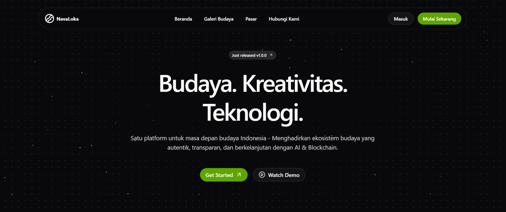

# NavaLoka: Platform AI & Blockchain untuk Pelestarian dan Ekonomi Kreatif Budaya Indonesia


_Gambar: Tampilan halaman beranda NavaLoka yang menampilkan slogan "Budaya. Kreativitas. Teknologi." dan tombol aksi utama dengan desain modern berwarna gelap dan pola kisi-kisi di latar belakang._

> **Catatan**: Simpan gambar landing page di folder `public/` dengan nama `landing-hero.png` (atau sesuaikan path di atas bila memakai nama lain/URL).

## 📋 Daftar Isi

- [Tentang NavaLoka](#tentang-navaloka)
- [Fitur Utama](#fitur-utama)
- [Teknologi yang Digunakan](#teknologi-yang-digunakan)
- [Flow Aplikasi](#flow-aplikasi)
- [System Architecture](#system-architecture)
- [Cara Menjalankan di Lokal](#cara-menjalankan-di-lokal)
- [Struktur Project](#struktur-project)
- [Tujuan dan Manfaat](#tujuan-dan-manfaat)
- [Model Bisnis](#model-bisnis)
- [Pengembangan Lanjutan](#pengembangan-lanjutan)

---

## 🎯 Tentang NavaLoka

NavaLoka adalah platform web berbasis AI dan blockchain yang menghubungkan pelaku budaya, masyarakat, dan publik global dalam satu ekosistem digital yang menghargai, melestarikan, serta memberdayakan nilai-nilai budaya Indonesia.

### Permasalahan yang Diangkat

Indonesia memiliki lebih dari 1.300 suku bangsa dengan kekayaan budaya yang luar biasa, namun nilai ekonominya masih jauh tertinggal dibanding potensi yang dimiliki. Berdasarkan data Indeks Pembangunan Kebudayaan (IPK), dimensi "Ekonomi Budaya" selalu menempati posisi terendah dalam tiga tahun terakhir.

Banyak karya turunan budaya seperti dokumentasi ritual, kerajinan, musik tradisional, tarian daerah, hingga kuliner lokal belum terdigitalisasi dengan baik. Di sisi lain, minimnya akses pasar, lemahnya dokumentasi, dan tidak adanya sistem autentikasi membuat karya budaya mudah hilang, disalahgunakan, atau diklaim pihak lain.

### Solusi NavaLoka

NavaLoka menghadirkan solusi terpadu berupa **pasar budaya digital (Cultural Marketplace)** di mana seniman, komunitas, dan pelaku budaya dapat:

1. Mengunggah karya digital turunan budaya untuk didokumentasikan dan dipamerkan secara daring
2. Menjual karya mereka secara langsung di marketplace dalam platform
3. Menyimpan metadata budaya di blockchain Solana, sebagai bukti autentik dan catatan kepemilikan digital yang aman dan transparan
4. Menambahkan narasi budaya interaktif yang dihasilkan AI, sehingga publik dapat memahami makna, filosofi, dan konteks sejarah di balik setiap karya

---

## ✨ Fitur Utama

### 1. Digital Cultural Marketplace

- Pelaku budaya dapat mengunggah karya digital turunan budaya (foto, musik, video, desain, dokumentasi, dll)
- Pembelian dan transaksi menggunakan mata uang lokal (IDR) melalui integrasi Xendit
- Setiap karya memiliki metadata budaya yang tersimpan di blockchain Solana, menjamin keaslian dan kepemilikan yang transparan

### 2. AI-Powered Cultural Narrator

- AI secara otomatis menghasilkan narasi interaktif dan edukatif tentang karya yang diunggah
- Menjelaskan asal-usul, filosofi, dan konteks budaya di balik setiap karya
- Fitur chatbot interaktif yang dapat menjawab pertanyaan terkait platform, karya, dan budaya

### 3. Cultural Registry & Preservation System

- Data budaya (metadata dan deskripsi naratif) disimpan dalam bentuk immutable record di blockchain
- Sistem ini membantu pemerintah, akademisi, dan komunitas dalam mendokumentasikan kekayaan budaya dengan standar digital global

### 4. Creator Dashboard & Analytics

- Panel kontrol bagi seniman dan komunitas untuk melihat statistik karya
- Analisis performa penjualan dan sebaran audiens
- Manajemen karya dan transaksi

### 5. Community Collaboration Hub

- Ruang kolaboratif antar seniman, peneliti, dan lembaga kebudayaan
- Berbagi karya, membuat proyek kolaboratif, dan membangun jejaring budaya digital Indonesia

---

## 🛠 Teknologi yang Digunakan

### Frontend

- **Next.js 16** (React Framework) - Framework utama untuk pengembangan web
- **Tailwind CSS** - Styling dan utility-first CSS framework
- **TypeScript** - Type-safe JavaScript
- **React Hook Form** - Form management
- **Zod** - Schema validation

### Backend & Database

- **Supabase** - Backend as a Service (Auth, Database, Storage)
- **PostgreSQL** - Database relasional (via Supabase)
- **Node.js Serverless Functions** - API endpoints

### Blockchain & Storage

- **Solana Devnet** - Blockchain untuk penyimpanan metadata budaya
- **IPFS** - Decentralized file storage untuk karya digital

### AI & Integrations

- **OpenAI API** - AI Storyteller & Chatbot untuk narasi budaya
- **Xendit API** - Payment gateway untuk transaksi IDR

### Deployment

- **Vercel** - Frontend deployment
- **Supabase Cloud** - Backend deployment

---

## 📊 Flow Aplikasi

### 1. User Registration & Onboarding

```
[User Register / Login]
       ↓
[Onboarding Page]
  "Apa tujuan Anda?"
       ↓
    ┌─────────────┐
    │   Pilih     │
    │   Tujuan    │
    └─────────────┘
       │
    ┌──┴──┬──────────┬──────────┐
    │     │          │          │
   ↓      ↓          ↓          ↓
[Pelaku  [Pembeli/  [Pelestari]
Budaya/  Kolektor]  Budaya]
Seniman]
```

### 2. Flow Pelaku Budaya/Seniman

```
[Pelaku Budaya/Seniman Dashboard]
       ↓
[Upload Karya Digital Turunan Budaya]
  • Upload file ke IPFS
  • Isi metadata (judul, deskripsi, asal budaya, dll)
       ↓
[Simpan Metadata di Solana Devnet]
  → Blockchain record (hash, timestamp, creator ID)
       ↓
[AI Storyteller Generate Narasi Budaya]
  • Berdasarkan deskripsi creator
  • Ditampilkan di halaman karya creator
       ↓
[Tampilkan di Cultural Marketplace]
  → Publik dapat melihat & membeli
       ↓
[Transaksi Pembelian via Xendit]
  • Pembeli bayar IDR
  • Xendit otomatis kirim royalti ke kreator
```

### 3. Flow Pembeli/Kolektor

```
[Pembeli/Kolektor Dashboard]
       ↓
[Lihat karya di Marketplace]
       ↓
[Pilih Karya Budaya]
       ↓
[Lihat Detail + AI storyteller + Bukti Keaslian Blockchain]
       ↓
[Beli via Xendit]
  → Pembayaran sukses → Karya tercatat di histori pembelian
  → Bukti kepemilikan digital (metadata hash)
```

### 4. Flow Pelestari Budaya

```
[Pelestari Budaya Dashboard]
       ↓
[Upload Dokumentasi Budaya (tanpa dijual)]
  • Foto / video / artikel dokumentatif
  • Tidak masuk marketplace
       ↓
[Simpan Metadata di Blockchain Solana]
  → Arsip budaya nasional digital (immutable)
       ↓
[AI Storyteller Tambahkan Narasi Edukatif]
       ↓
[Tampil di Galeri Budaya Publik]
  • Bisa dilihat masyarakat tanpa transaksi
```

---

## 🏗 System Architecture

```
┌─────────────────────────────────────┐
│  Frontend: Next.js + Tailwind CSS   │
└──────────────┬──────────────────────┘
               │
               ▼
┌─────────────────────────────────────┐
│  Backend: Supabase                   │
│  (Auth, DB, Storage)                 │
└───┬─────────────────────────────────┘
    │
    ├───► [Xendit API] ──► Payment & Disbursement
    │
    ├───► [Solana Devnet] ──► Metadata & Provenance Storage
    │
    ├───► [IPFS] ──► File Storage (Decentralized)
    │
    └───► [OpenAI API] ──► AI Storyteller & Chatbot
```

### Penjelasan Arsitektur

1. **Frontend Layer**: Next.js dengan Tailwind CSS untuk UI/UX yang responsif dan modern
2. **Backend Layer**: Supabase sebagai BaaS yang menangani autentikasi, database, dan storage
3. **Blockchain Layer**: Solana Devnet untuk penyimpanan metadata yang immutable dan transparan
4. **Storage Layer**: IPFS untuk penyimpanan file terdesentralisasi
5. **AI Layer**: OpenAI API untuk generate narasi budaya dan chatbot interaktif
6. **Payment Layer**: Xendit API untuk transaksi pembayaran dalam IDR

---

## 🚀 Cara Menjalankan di Lokal

### Prerequisites

Pastikan Anda telah menginstall:

- **Node.js** (versi 18 atau lebih baru)
- **npm** atau **yarn** atau **pnpm**
- **Git**

### Langkah-langkah Setup

1. **Clone Repository**

```bash
git clone https://github.com/diwanmuhamad/navaloka.git
cd navaloka
```

2. **Install Dependencies**

```bash
npm install
# atau
yarn install
# atau
pnpm install
```

3. **Setup Environment Variables**

Buat file `.env.local` di root project dengan konfigurasi berikut:

```env
# Supabase
NEXT_PUBLIC_SUPABASE_URL=your_supabase_url
NEXT_PUBLIC_SUPABASE_ANON_KEY=your_supabase_anon_key

# OpenAI
OPENAI_API_KEY=your_openai_api_key

# Xendit
XENDIT_SECRET_KEY=your_xendit_secret_key
XENDIT_PUBLIC_KEY=your_xendit_public_key

# Solana
SOLANA_RPC_URL=
SOLANA_WALLET_PRIVATE_KEY=your_solana_private_key

# IPFS
PINATA_JWT=
```

4. **Jalankan Development Server**

```bash
npm run dev
# atau
yarn dev
# atau
pnpm dev
```

5. **Akses Aplikasi**

Buka browser dan akses: [http://localhost:3000](http://localhost:3000)

### Scripts yang Tersedia

```bash
# Development mode
npm run dev

# Build untuk production
npm run build

# Jalankan production build
npm run start

# Linting
npm run lint
```

---

## 📁 Struktur Project

```
navaloka/
├── app/                      # Next.js App Router
│   ├── page.tsx              # Halaman beranda
│   ├── layout.tsx            # Root layout
│   ├── login/                # Halaman login
│   ├── signup/               # Halaman signup
│   └── contact-us/           # Halaman kontak
├── components/               # Komponen React
│   ├── ui/                  # UI components (shadcn/ui)
│   ├── hero.tsx             # Hero section
│   ├── navbar.tsx           # Navigation bar
│   ├── footer.tsx           # Footer
│   ├── features.tsx        # Features section
│   ├── faq.tsx             # FAQ section
│   ├── testimonials.tsx    # Testimonials section
│   ├── contact.tsx         # Contact section
│   ├── login-form.tsx      # Login form
│   └── signup-form.tsx    # Signup form
├── lib/                     # Utility functions
│   ├── utils.ts            # Utility functions
│   ├── supabaseClient.ts   # Supabase client
│   └── validations/        # Validation schemas
│       └── authSchema.ts   # Auth validation
├── store/                   # Redux store
│   └── store.ts            # Store configuration
├── types/                   # TypeScript types
├── public/                  # Static files
├── package.json            # Dependencies
├── tsconfig.json           # TypeScript config
├── tailwind.config.ts      # Tailwind config
└── README.md               # Dokumentasi
```

---

## 🎯 Tujuan dan Manfaat

### Tujuan Utama

NavaLoka bertujuan untuk menciptakan ekosistem digital budaya yang inklusif, berkelanjutan, dan bernilai ekonomi, di mana pelaku budaya Indonesia dapat:

- Mendokumentasikan karya budaya secara aman di blockchain
- Meningkatkan literasi budaya melalui teknologi AI
- Memonetisasi karya dengan cara yang adil dan transparan
- Mempromosikan budaya Indonesia di tingkat global melalui kanal digital modern

### Manfaat Jangka Panjang

#### Bagi Pelaku Budaya dan Seniman Lokal

- Mendapatkan sarana pemasaran dan pendapatan langsung melalui marketplace budaya digital
- Terlindungi dari plagiarisme dan klaim tidak sah melalui pencatatan metadata di blockchain
- Meningkatkan visibilitas karya budaya ke audiens nasional maupun global

#### Bagi Komunitas & Pemerintah

- Menjadi arsip digital budaya nasional yang terdesentralisasi dan transparan
- Mendukung program pelestarian budaya nasional dengan data yang tervalidasi dan terdokumentasi

#### Bagi Masyarakat & Generasi Muda

- Menjadi media pembelajaran budaya yang interaktif dan menarik berkat narasi AI
- Mendorong tumbuhnya kesadaran dan kebanggaan terhadap budaya lokal di era digital

#### Bagi Ekosistem Digital Indonesia

- Mendorong integrasi antara AI, Web3, dan ekonomi kreatif
- Memperkuat posisi Indonesia sebagai pelopor inovasi budaya digital di Asia Tenggara

---

## 💼 Model Bisnis

### Sumber Pendapatan

1. **Platform Fee (5%)**

   - Potongan dari setiap transaksi penjualan karya budaya di marketplace

2. **Program Sponsor dan Event Kolaboratif**

   - Kerja sama dengan lembaga, perusahaan, dan festival budaya untuk promosi dan monetisasi karya

3. **API Access untuk Lembaga Pendidikan & Penelitian**

   - Membuka akses data budaya terkurasi dengan skema berlangganan (subscription) bagi universitas, museum, dan peneliti

4. **Partnership Ekosistem Digital**
   - Kerja sama dengan platform pembayaran, NFT marketplace, dan jaringan blockchain lokal untuk memperluas jangkauan dan interoperabilitas

---

## 🔮 Pengembangan Lanjutan

### Tahap Lanjutan

1. **Kolaborasi Strategis**

   - Kolaborasi dengan Kementerian Kebudayaan, komunitas adat, lembaga riset, dan seniman lokal untuk memperluas ekosistem konten budaya

2. **Optimalisasi Mobile**

   - Optimalisasi versi mobile web (PWA – Progressive Web App) agar platform tetap ringan, cepat, dan dapat diakses dari berbagai perangkat

3. **Cultural Data Map Indonesia**

   - Integrasi peta digital interaktif yang menampilkan persebaran budaya dan karya komunitas dari berbagai daerah

4. **Fitur AI Lanjutan**

   - AI Plagiarism Detector untuk menjaga orisinalitas konten budaya digital
   - AI Visual Recognition (Cultural Image Classifier)
   - AI Audio Analyzer (untuk Musik Tradisional)
   - AI Cultural Knowledge Graph
   - AI Cultural Translator

5. **Skalabilitas Blockchain**

   - Meningkatkan skalabilitas Integrasi Cultural Metadata Registry on Blockchain untuk memastikan pelacakan dan arsip digital budaya yang transparan dan permanen

6. **API Public**
   - Integrasi lintas platform dengan pengembangan API yang dapat diakses pihak luar

---

## 📞 Kontak

- **Email**: diwanmuhamad37@gmail.com
- **Telepon**: 081246505738
- **GitHub**: [https://github.com/diwanmuhamad/navaloka](https://github.com/diwanmuhamad/navaloka)

---

## 📄 Lisensi

Proyek ini dikembangkan untuk kompetisi **BUDAYA GO! 2025 - Kompetisi Inovasi Digital Budaya Indonesia**.

---

## 🙏 Terima Kasih

Terima kasih telah melihat proyek NavaLoka! Kami berharap platform ini dapat berkontribusi dalam pelestarian dan pemberdayaan budaya Indonesia melalui teknologi modern.

**Budaya. Kreativitas. Teknologi.** 🇮🇩
